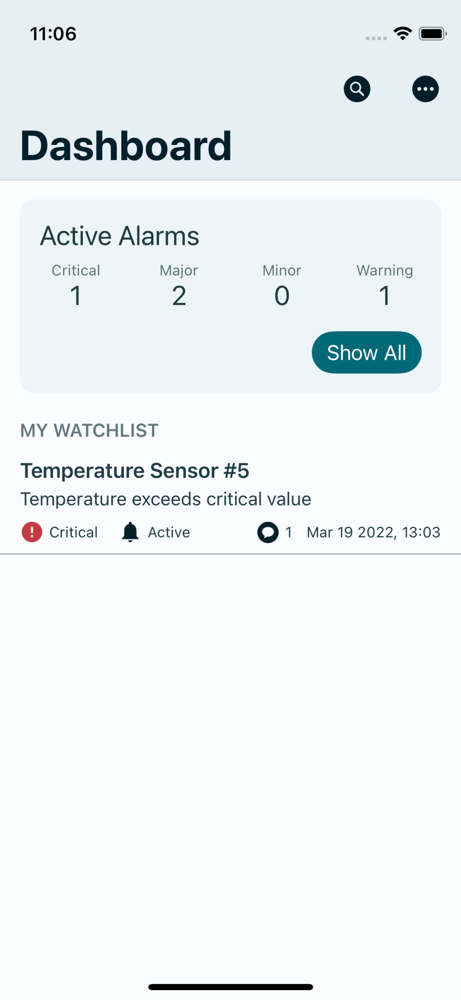
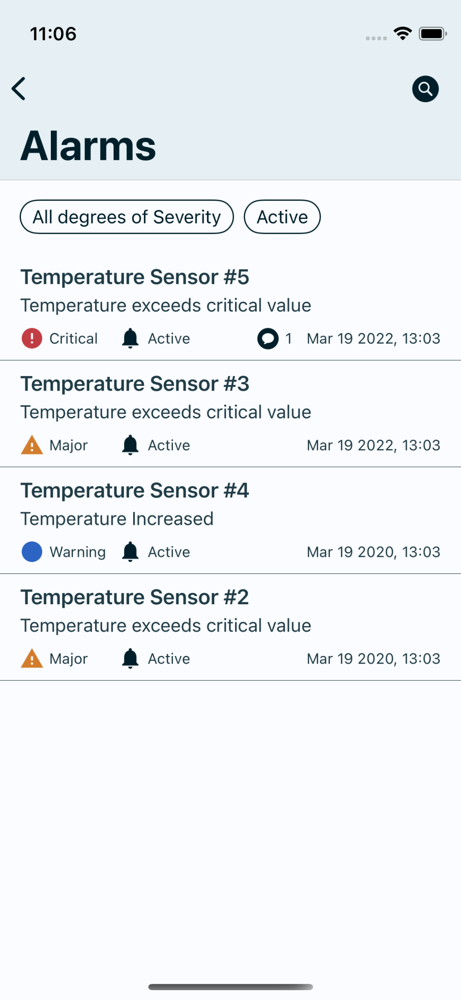
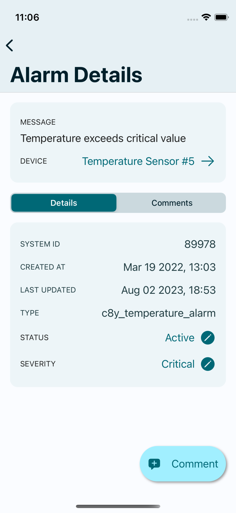
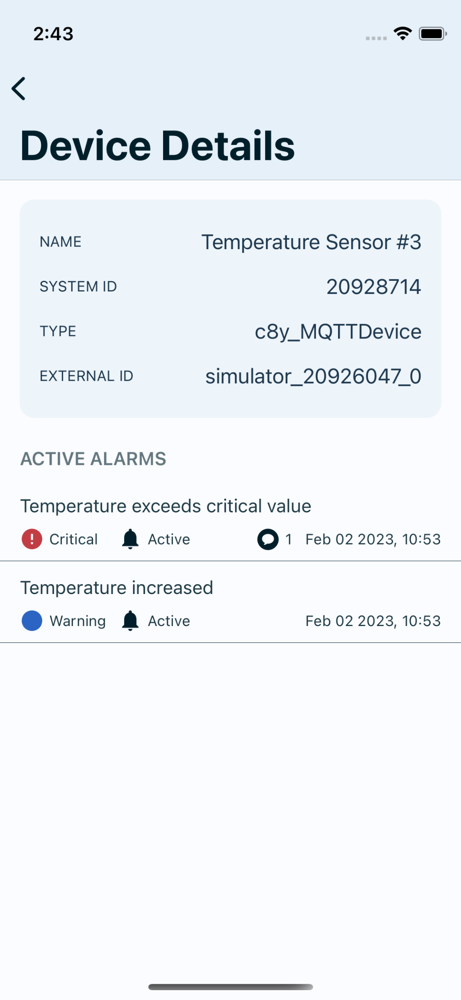

# Cumulocity IoT Alarm App

The Cumulocity IoT Alarm App seamlessly delivers alarms to your mobile phone, offering a comprehensive overview of all alarms raised on your Cumulocity IoT tenant. You can effortlessly browse or filter through the list of alarms, collaborate by adding comments, and modify the alarm's severity or status.

By utilizing this open-source application, you can significantly reduce the development time of your own application while benefiting from enhanced source code quality and reliability. The application provides a range of functionalities, including:

- Provides visibility of device alarms and events on the Cumulocity IoT platform. ​
- Get details like number of alarms, first occurrences, alarm status and alarm recency.​
- Alarms can be viewed, acknowledged and cancelled from the mobile device.​
- Add comments on the alarms to add additional info and use it to collaborate within teams
- Customize your alarm watchlist to filter alarms based on your specific preferences and priorities.
- Supports real-time push notifications for alarms as per watchlist ​    

   

**Note**: For enabling push notifications you will require a dedicated microservices to be deployed on your Cumulocity IoT tenant. [More Details](./microservices/README.md) 

## Trying out the Application !

Currently you can try out the application on Android by downloading the apk file from the release.

**Downloading the APK**
- Visit the releases section of this GitHub repository [here](https://github.com/SoftwareAG/cumulocity-alarmapp/releases)
- Look for the latest release containing the APK file. Releases are tagged with version numbers for easy identification.
- Download the APK file by clicking on the file name under the "Assets" section. It will typically have a ".apk" extension.

**Installing the App**
- **Note**: Ensure that your device permits installations from unknown sources. You can activate this option in your device settings under "Security" or "Biometrics and security."
- Once the APK file is downloaded, locate it in your device's file manager or download folder.
- Tap on the APK file to start the installation process.
- If prompted, confirm that you want to install the app from an unknown source.
- Follow the on-screen instructions to complete the installation.
- Once installed, open the app and enter a Cumulocity IoT tenant along with your user credentials and start exploring.

## Building your own Application: Getting Started

This repository contains open-source code you can use to build the Alarm App for Android and iOS as well as to build the needed microservices for enabling push notifications.

- [How to build for iOS?](./ios/README.md)
- [How to build for Android?](./android/README.md)
- [How to build and deploy the microservices?](./microservices/README.md) 

The latest release can be found [here](https://github.com/SoftwareAG/cumulocity-alarmapp/releases/latest). 

The release contains binaries for Android and iOS:

- An unsigned `APK` file, which can be distributed to devices,
- An unsigned `IPA` file, which can be distributed, but must be signed before deployed to devices.

The latest build archive does not contain microservices. Some properties belong to your environment and must be configured before building the microservices.

## Contact

For all questions, please contact IoT-Analytics-Mobile-Accelerator@softwareag.com.

## Contribution

If you've spotted something that doesn't work as you'd expect, or if you have a new feature you'd like to add, we're happy to accept contributions and bug reports.

For bug reports, please raise an issue directly in this repository by selecting the `issues` tab and then clicking the `new issue` button. Please ensure that your bug report is as detailed as possible and allows us to reproduce your issue easily.

In the case of new contributions, please create a new branch from the latest version of `main`. When your feature is complete and ready to evaluate, raise a new pull request.

---

These tools are provided as-is and without warranty or support. They do not constitute part of the Software AG product suite. Users are free to use, fork and modify them, subject to the license agreement. While Software AG welcomes contributions, we cannot guarantee to include every contribution in the master project.
