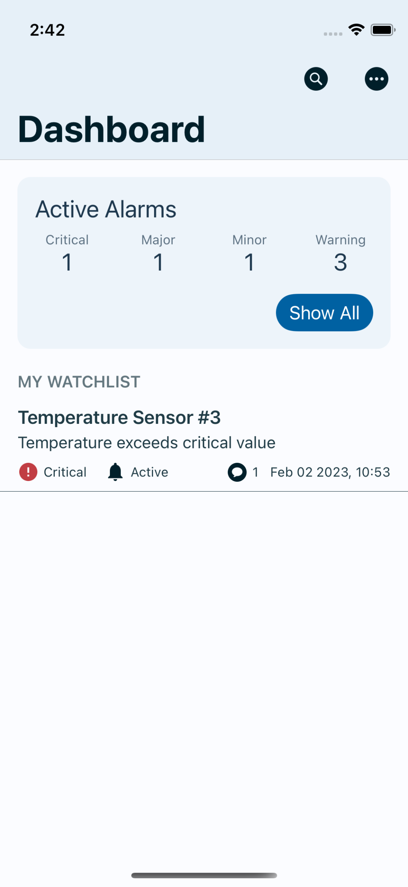
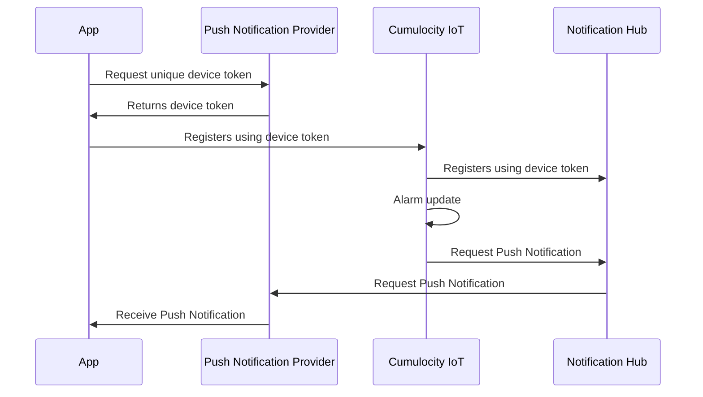

# Cumulocity IoT Alarming App

The Cumulocity IoT Alarming App brings alarms on your mobile phone. You'll see an overview about all Alarms raised on your Cumulocity IoT tenant, browse or filter the list of Alarms, collaborate by adding comments or modify the Alarm's severity or status.

Each update on an Alarm triggers a Push Notification to be sent to your device. Open the notification to quickly jump to the modified Alarm. A common use case is to inform certain users when problems occur at certain devices. *Push Notifications require a dedicated micro service to be deployed on your Cumulocity IoT tenant.*

> *The Cumulocity IoT Alarming App is currently only available for iOS 13+. An Android version will follow.*

{:width=”50%” height=”auto”}


## Configuring Push Notifications

The Cumulocity IoT Alarming App leverages Push Notifications to send messages to your device. One requirement is a dedicated Microservice named *Push Gateway* deployed on your Cumulocity IoT tenant. 

> The Cumulocity IoT Push Gateway is a microservice extension to the Cumulocity IoT platform. It enables mobile applications to receive push notifications sent from Cumulocity IoT.

The Push Gateway will listen to Alarm updates and creates a Push Notification if an update is received. Therefore, the mircoservice integrates Microsoft Azure's [Notification Hub](http://https://azure.microsoft.com/en-gb/products/notification-hubs/ "Notification Hub") - mainly to handle all device registrations and actually sending a Push Notification. A device registration is a unique identifier used by Apple Push Notification Service and Google's Firebase to identifiy the mobile application when sending a Push Notification to the device.




When using Push Notifications, make sure to check the following:

- [] Got yourself an Microsoft Azure account and setup a Notification Hub.
- [] Deploy and subscribe the *Push Gateway*. Use the Notification Hubs authorization keys.
- [] **iOS** only - Enable the capability *Push Notification* with your Provisioning Profile.

> Please keep in mind that neither Apple or Google guarantee the delivery of a Push Notification.

## Build the Alarming App for iOS

### Installation and Setup

The following tools are required to build the app:

- Xcode 13.2+

#### Cumulocity IoT Swift Client SDK

The Cumulocity IoT Alarming App takes use of the Cumulocity Swift client SDK to integrate Cumulocity IoT. The client SDK is added as a SwiftPackage from it's repository at [https://github.com/SoftwareAG/cumulocity-clients-swift](https://github.com/SoftwareAG/cumulocity-clients-swift).

For SwiftPackage it is required to configure a [github.com](https://github.com) user account with access to the repository. The user account must be using a developer token for authentication. It's recommended to setup the user account in Xcode before opening the project the first time in Xcode.

#### Build

`Build` github worlflow creates an unsigned ipa as well as an Xcode Archive. The ipa file may be uploaded to the App Store or deployed to devices using a Mobile-Device-Management (MDM) solution.

The latest release can be found [here](https://github.com/SoftwareAG/cumulocity-alarmapp/releases/latest).

> **This build can be distributed, but must be signed before deployed to devices.**

#### Code Sign

In your Apple developer account, enable the Push Notification service for the App ID assigned to your project. For more information about configuring your developer account, go to your Apple Developer Account page.

##### Using Fastlane

To sign the ipa, it is recommended to use [Fastlane](https://fastlane.tools). See documentation for [Fastlane resign](https://docs.fastlane.tools/actions/resign/) for more infos and config options, for example to change version number, display name, etc. when resigning.

```bash
> fastlane run resign ipa:./AlarmApp.ipa signing_identity:"<Keychain Identity of certificate>" provisioning_profile:<path provisioning profile>
```

## Contact

For all questions, please contact IoT-Analytics-Mobile-Accelerator@softwareag.com.

## Contribution

If you've spotted something that doesn't work as you'd expect, or if you have a new feature you'd like to add, we're happy to accept contributions and bug reports.

For bug reports, please raise an issue directly in this repository by selecting the `issues` tab and then clicking the `new issue` button. Please ensure that your bug report is as detailed as possible and allows us to reproduce your issue easily.

In the case of new contributions, please create a new branch from the latest version of `main`. When your feature is complete and ready to evaluate, raise a new pull request.

---

These tools are provided as-is and without warranty or support. They do not constitute part of the Software AG product suite. Users are free to use, fork and modify them, subject to the license agreement. While Software AG welcomes contributions, we cannot guarantee to include every contribution in the master project.
