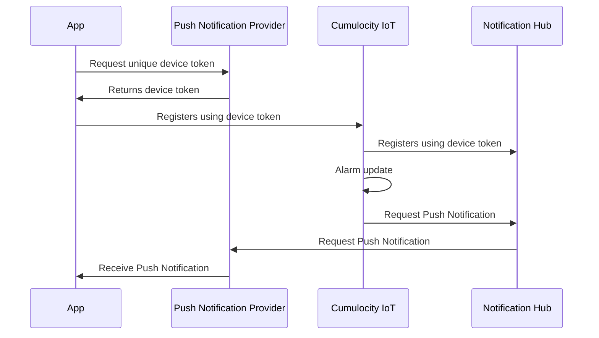

# Configuring Push Notifications

The Cumulocity IoT Alarming App leverages push notifications to send messages to your device. One requirement is a dedicated microservice named *Push Gateway* deployed on your Cumulocity IoT tenant. 

> The Cumulocity IoT Push Gateway is a microservice extension to the Cumulocity IoT platform. It enables mobile applications to receive push notifications sent from Cumulocity IoT.

The Push Gateway will listen to Alarm updates and creates a push notification if an update is received. Therefore, the mircoservice integrates Microsoft Azure's [Notification Hub](http://https://azure.microsoft.com/en-gb/products/notification-hubs/ "Notification Hub") - mainly to handle all device registrations and actually sending a push notification. A device registration is a unique identifier used by Apple Push Notification Service (APNS) and Google's Firebase to identifiy the mobile application when sending a push notification to the device.

When using push notifications, make sure to check the following:

- [ ] Got yourself an Microsoft Azure account and setup a Notification Hub.
- [ ] Deploy and subscribe the *Push Gateway*. Use the Notification Hubs authorization keys.
- [ ] **iOS** only - Enable the capability *Push Notification* with your app `Identifier`.
- [ ] **Android** only - Register your app on Firebase. Download a JSON profile on Firebase and store it within the root folder.

> Please keep in mind that neither Apple or Google guarantee the delivery of a push notification.